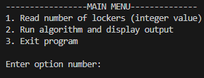

# Algorithm Design Block

Each project comes prefaced with a design block to show the pre-code thought process behind each algorithm.

Format is as follows
```
===========================================
Algorithm Title

Logical Steps
  step 1
  step 2
    ...
  step n

Algorithm purpose
Required Input
Desired Output

Pseudocode
===========================================
```
## Locker Doors
This is an approach to the old locker doors math puzzle...
```
There are n lockers in a hallway, numbered sequentially from 1 to n. 
Initially, all the locker doors are closed. You make n passes by the lockers, each time starting with locker 1.
On the ith pass, i = 1, 2, . . . , n, you toggle the door of every ith locker: if the door is closed, you open it; 
if it is open, you close it. After the last pass, which locker doors are open, and which are closed? 
```
User is prompted with a menu and my algorithm takes care of the rest<br><br>


## Anagram Test
User is prompted with a menu. Option 1 asks for two words or phrases. Option 2 implements my anagram test algorithm. 

